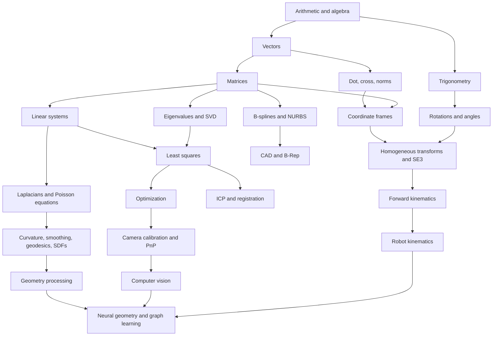

# Knowledge Layer for Geometry Processing, Computer Vision, Robot Kinematics, and AI in C++

## Mission and source layer

This document is designed to function as a compact **knowledge layer** for both you and an AI agent: not an encyclopedia of all mathematics, but a map of the **minimum set of mathematical ideas, algorithms, and implementation patterns** that repeatedly show up in geometry processing, computer vision, robot kinematics, and modern AI systems built around them. I am treating your uploaded pasted-content bundles as seed material, your uploaded *The Essential Mathematics for Computational Design* PDF as a bridge text, and your uploaded scan-to-BIM notes as the architectural direction for the standalone stack described below. An additional uploaded PDF is retained as source context, but I do not rely on it directly here because it was not clearly inspectable in this session. fileciteturn0file0 fileciteturn0file2 fileciteturn0file3 fileciteturn0file1

The external backbone of this layer comes from sources that are unusually well aligned with your goals: Keenan Crane’s CMU/Brick Island materials for discrete differential geometry and mesh computation, OpenCV’s official camera-geometry documentation, OpenCASCADE’s official B-spline and meshing APIs, IfcOpenShell’s geometry-processing documentation, the signed heat method work of Feng and Crane for robust signed distance on defective geometry, Geogram’s official documentation for Voronoi/Delaunay/optimal transport infrastructure, Haviland and Corke’s manipulator kinematics tutorial, and primary model papers for transformers, graph neural networks, point clouds, and neural implicit geometry. citeturn10view0turn11view2turn2view0turn3view0turn3view1turn4view0turn15view0turn18view0turn24view0turn33view0turn34view0turn35view0turn35view3

Your own reverse-engineering notes already point toward the right production architecture: **registration/alignment → defect-tolerant shape recovery → remeshing/conditioning → NURBS/B-Rep fitting → IFC serialization**. What this report does is tighten that architecture mathematically, show how the three fields fit together, and give you a C++ reference core that can grow into a standalone software stack independent of Rhino and Grasshopper. fileciteturn0file3

## Dependency graph of the math

The most important pedagogical simplification is this: **you do not need all math; you need the dependency graph of the math that your workflows actually consume**. For your use case, the trunk is: arithmetic → algebra/trigonometry → vectors and matrices → coordinate frames and transformations → least squares and optimization → calculus and Jacobians → discrete geometry/PDEs on meshes → domain-specific algorithms in vision, robotics, and geometric modeling. Crane’s DDG course explicitly lists linear algebra, vector calculus, and programming as prerequisites, and then builds practical geometry algorithms from curvature, Laplacians, finite elements, geodesics, and numerical linear algebra. citeturn11view2



At the linear-algebra level, the same objects keep reappearing with different names. In computer vision, OpenCV writes the pinhole model as  
\[
s\,p = A [R|t] P_w,
\]
where \(A\) is the intrinsic matrix and \(R,t\) move points from world to camera coordinates. In robotics, Haviland and Corke describe manipulator pose as an element of \(\mathrm{SE}(3)\), again a homogeneous transform with a rotation block and translation. These are not two different ideas. They are the same mathematical object used in two different application stories. citeturn2view0turn24view0

At the calculus and numerical level, the same pattern also repeats. OpenCV calibration minimizes reprojection error using nonlinear optimization around `projectPoints`, while DDG and signed-distance methods solve sparse linear systems built from Laplacians, mass matrices, or Poisson equations. The signed heat method explicitly reduces robust distance computation to a small number of sparse PDE solves, and Crane’s course materials call the cotan Laplacian the “Swiss army knife” of discrete geometry processing because it is the workhorse under smoothing, Poisson solves, curvature flow, and many related mesh operators. citeturn23view2turn15view0turn11view0

At the spline/modeling level, NURBS matter because they unify “engineering shapes” and “freeform shapes” in one representation. Piegl’s survey explains that NURBS were adopted because they provide a common mathematical form for conics, quadrics, surfaces of revolution, and free-form curves and surfaces; it also gives the standard rational B-spline form and emphasizes locality, convex-hull behavior, differentiability tied to knot multiplicity, and invariance under affine and perspective transformations. The same survey also traces the historical route through Coons, de Boor, Cox, Mansfield, Riesenfeld, and Versprille, noting that Versprille’s 1975 work is the first written account of NURBS. citeturn20view0

A compact “formula kit” for your workflows therefore looks like this:

\[
T = \begin{bmatrix}R & t \\ 0 & 1\end{bmatrix},
\qquad
s\,p = K[R|t]X,
\qquad
{}^{0}T_e(q)=\prod_i E_i(q_i),
\]
\[
\Delta u = \rho,
\qquad
C(u)=\frac{\sum_i N_{i,p}(u)w_iP_i}{\sum_i N_{i,p}(u)w_i},
\qquad
\mathrm{Attention}(Q,K,V)=\mathrm{softmax}\!\left(\frac{QK^T}{\sqrt{d_k}}\right)V.
\]

Those six expressions cover most of the reusable mathematical grammar behind camera estimation, rigid motion, robot FK/IK, mesh PDEs, CAD curve/surface building, and transformer-style AI. citeturn2view0turn24view0turn20view0turn33view0

## How the domains fit together

The cleanest way to understand the relationship between geometry processing, computer vision, and robot kinematics is to see them as three layers of one system. **Vision measures the world**, **geometry processing regularizes and models the world**, and **robot kinematics moves through the world**. The device that glues them together is the rigid transform in \(\mathrm{SE}(3)\), and the language that glues their algorithms together is least squares, Jacobians, and constrained optimization. citeturn2view0turn24view0turn28view0

### Computer vision as the measurement layer

OpenCV’s official camera model states that a world point is projected into the image by a pinhole transform with intrinsics \(K\) and extrinsics \([R|t]\), and its `calibrateCamera`, `solvePnP`, and `projectPoints` functions all revolve around that geometry. `projectPoints` explicitly describes the chain as world coordinates → camera coordinates → normalized camera coordinates → distortion → pixel coordinates, and calibration minimizes reprojection error over that chain. This is why your current OpenCV knowledge is useful but incomplete: OpenCV is not “an image library” first; it is a software wrapper around projective geometry and nonlinear estimation. citeturn2view0turn23view1turn23view2

For your workflow, the most important vision idea is **pose from correspondences**. If you can detect 2D image points that correspond to known 3D points on a calibration object, a robot, or a design template, `solvePnP` gives you a camera pose. Once that pose is known, vision becomes a source of metric constraints that geometry processing and robotics can use. In other words, the output of vision is rarely “the answer”; it is usually a transformation, a confidence score, and some correspondences that feed the next stage. citeturn23view0turn23view2

### Robot kinematics as the motion layer

Haviland and Corke define manipulator kinematics as the study of a robot’s link motion **without forces**, and write forward kinematics as a nonlinear map from joint coordinates \(q\) to an end-effector pose in \(\mathrm{SE}(3)\). Their tutorial uses an elementary transform sequence, but the central idea is the same as DH or product-of-exponentials: the end-effector pose is the ordered product of rigid transforms, and the Jacobian is the derivative that maps joint velocity to task-space velocity. citeturn24view0

This is exactly why FK, IK, and Jacobians matter even for design and reverse engineering. If you want an industrial arm to place scanned stone onto a top-down template, you need: a target pose from geometry/vision, a calibrated transform from camera/world to robot base, and then an IK solver that yields feasible joint angles. Hand-eye calibration is literally the problem of solving transformation equations such as \(\mathbf{AX}=\mathbf{ZB}\), connecting robot, camera, and world frames. In recent work on camera-to-robot pose estimation, learned keypoints are detected from an image, then classical PnP geometry is used to recover the extrinsics. That is a perfect example of the classical-learning hybrid you should internalize: **perception can be learned, but pose still lives in geometry**. citeturn28view0turn1academia3turn23view0

Inverse kinematics is difficult because the map from pose to joints is nonlinear and often non-unique. Near singularities, the problem becomes ill-conditioned; recent IK work still frames the numerical core in terms of Jacobian pseudoinverses and damped least-squares methods, and treats damping as the robust default near singular configurations. For your purposes, this means that learning IK is valuable, but only **after** you understand the FK chain, the Jacobian, and the geometry of singularity. citeturn27academia1turn24view0

### Geometry processing as the shape layer

Crane’s DDG course is especially relevant because it shows how smooth geometric ideas become discrete algorithms on meshes. Its curvature assignment gives concrete formulas for angle defect, mean curvature, vertex normals, and dual areas, and its Laplacian assignment shows how the cotan Laplacian, mass matrix, and Poisson equation become actual code for curvature flow and scalar fields on surfaces. This is the mathematical bridge from “Grasshopper intuition” to “geometry-processing software.” citeturn11view1turn11view0

In your scan-to-CAD / scan-to-BIM problem, geometry processing does four jobs. First, it **registers** raw data by matching frames and point sets. Second, it **repairs or regularizes** imperfect data, which is why the signed heat method is useful: it approximates generalized signed distance for geometry with holes, noise, or self-intersections by diffusing normals, normalizing the field, and integrating a best-fit scalar field, all via sparse PDE solves. Third, it **conditions** geometry for modeling, often through remeshing or resampling. Fourth, it **lifts** discrete data into CAD-friendly parametric or analytic models such as B-splines/NURBS. citeturn15view0turn11view0turn18view0turn3view0

That entire chain is already implicit in your pasted reverse-engineering notes. The signed heat method library documents itself as a C++ implementation for robust signed distance to triangle meshes, polygon meshes, and point clouds; Geogram documents itself as a geometric-algorithm library with Delaunay, Voronoi, spatial search, intersection machinery, and semi-discrete optimal transport; OpenCASCADE’s `GeomAPI_PointsToBSplineSurface` approximates a B-spline surface through an array of points with degree, continuity, and tolerance controls; and `BRepMesh_IncrementalMesh` triangulates `TopoDS_Shape` geometry for downstream exchange or display. fileciteturn0file3 citeturn14view0turn15view0turn18view0turn3view0turn3view1

The practical conclusion is simple: **vision gives poses, geometry gives surfaces, robotics gives motion, and all three are expressions of the same transform-optimization language**. Once you see that, your learning path becomes much less fragmented. citeturn2view0turn24view0turn15view0turn28view0

## AI model math that actually matters here

For your domains, AI is most useful when you understand it as a set of **parameterized functions trained by optimization**, not as a magical replacement for geometry. The universal pattern is: choose a representation, define a loss, compute gradients, optimize parameters, and then attach the learned module to geometric computation. The exact representation changes by domain, but the calculus underneath is still linear maps, nonlinearities, Jacobians, and optimization. citeturn33view0turn34view0turn35view3

The transformer paper is valuable here not because you should start by building language models, but because it makes the algebra visible. Scaled dot-product attention is  
\[
\mathrm{Attention}(Q,K,V)=\mathrm{softmax}\!\left(\frac{QK^T}{\sqrt{d_k}}\right)V,
\]
and the feed-forward block is just two affine maps with a nonlinearity between them. That is the right mental model for “AI math”: mostly matrix multiplication, normalization, and differentiable composition, repeated at scale. citeturn33view0

For graph-structured geometry, Kipf and Welling’s GCN paper is more directly relevant than generic deep-learning tutorials. It writes graph learning as repeated propagation through a normalized adjacency operator,
\[
H^{(l+1)}=\sigma\!\left(\tilde D^{-1/2}\tilde A \tilde D^{-1/2} H^{(l)}W^{(l)}\right),
\]
and explicitly connects graph learning to graph Laplacian regularization. This matters for you because meshes, skeletons, visibility graphs, adjacency structures, and kinematic chains are all graphs. Once you already know the Laplacian from DDG, GNNs become much less mysterious: they are learnable message-passing layers on top of graph operators you already recognize. citeturn34view0turn11view0

For raw point clouds, PointNet is the right conceptual starting point because it directly addresses the irregular, permutation-invariant nature of point sets. Its abstract contribution is not merely “good performance”; it is the recognition that point clouds are not images and should not be forced into voxel grids unless necessary. That is why PointNet-like thinking is closer to your scan workflows than image-only CNN thinking. citeturn35view0

For learned 3D geometry, Occupancy Networks are a clean conceptual bridge from classical signed distance thinking to neural implicits. Mescheder and colleagues describe occupancy networks as representing a 3D surface as the continuous decision boundary of a neural classifier, giving effectively continuous output resolution without a dense voxel grid. Conceptually, this sits right next to classical signed distance and level-set methods; the difference is that the field is learned rather than solved purely from a hand-designed PDE. citeturn35view3

The most important practical lesson is that in geometry/vision/robotics systems, **AI usually helps at detection, correspondence, segmentation, or priors**, while classical math still dominates at projection, registration, kinematics, and constraint satisfaction. The camera-to-robot pose-estimation example is emblematic: a network predicts keypoints from an RGB image, but pose is still recovered with PnP once intrinsics and robot geometry are known. That is the right hybrid mental model for your future software. citeturn1academia3turn23view0

## Reference C++ workflow for stone scan to CAD

Your problem statement is unusually concrete: **independent of Rhino/Grasshopper, start from point clouds or meshes, regularize irregular stone geometry against a top-down template, and grow toward CAD and IFC**. The clean production architecture for that is:

**capture / read** → **align** → **regularize** → **fit a smooth field or spline** → **promote to CAD** → **serialize to exchange formats**. Your own uploaded notes explicitly frame the intended production direction around alignment, NURBS fitting, and IFC export. fileciteturn0file3

A good first standalone C++ reference implementation should therefore do only the mathematically essential things, and do them clearly:

1. read a point cloud,  
2. estimate a local frame with PCA,  
3. align it to a regular template frame,  
4. rasterize the irregular surface into a regular \(u,v\) grid,  
5. smooth the sampled height field with a discrete Laplacian data term,  
6. export an OBJ mesh and a **B-spline-ready control grid** for later OpenCASCADE fitting.  

This gives you a fully compilable, inspectable core before you add heavyweight dependencies such as OpenCASCADE, signed-heat-3d, or IfcOpenShell. The underlying math is standard least squares, eigenanalysis, and discrete smoothing. Registration itself is commonly posed as least-squares rigid alignment, for which the Kabsch–Umeyama family is the standard SVD solution; your uploaded notes also identify ICP-style alignment as the practical first stage in scan-to-CAD workflows. citeturn29academia0 fileciteturn0file3

### Minimal compilable core

`CMakeLists.txt`

```cmake
cmake_minimum_required(VERSION 3.16)
project(stone_template_fit LANGUAGES CXX)

set(CMAKE_CXX_STANDARD 17)
set(CMAKE_CXX_STANDARD_REQUIRED ON)

find_package(Eigen3 REQUIRED)

add_executable(stone_template_fit stone_template_fit.cpp)
target_link_libraries(stone_template_fit PRIVATE Eigen3::Eigen)
```

`stone_template_fit.cpp`

```cpp
#include <Eigen/Dense>
#include <Eigen/Eigenvalues>

#include <array>
#include <cmath>
#include <fstream>
#include <iostream>
#include <limits>
#include <sstream>
#include <stdexcept>
#include <string>
#include <vector>

struct Grid {
    int nu = 0;
    int nv = 0;
    double umin = 0.0, umax = 0.0;
    double vmin = 0.0, vmax = 0.0;
    double du = 0.0, dv = 0.0;
    std::vector<double> z;      // smoothed heights
    std::vector<double> z_data; // raw data term
    std::vector<double> w;      // sample counts / confidence
};

static int idx(int i, int j, int nv) {
    return i * nv + j;
}

std::vector<Eigen::Vector3d> load_xyz_points(const std::string& path) {
    std::ifstream in(path);
    if (!in) {
        throw std::runtime_error("Could not open input file: " + path);
    }

    std::vector<Eigen::Vector3d> pts;
    std::string line;

    while (std::getline(in, line)) {
        if (line.empty()) continue;
        for (char& c : line) {
            if (c == ',') c = ' ';
        }

        std::istringstream iss(line);
        double x, y, z;
        if (iss >> x >> y >> z) {
            pts.emplace_back(x, y, z);
        }
    }

    if (pts.empty()) {
        throw std::runtime_error("No 3D points found in input.");
    }
    return pts;
}

Eigen::Vector3d centroid(const std::vector<Eigen::Vector3d>& pts) {
    Eigen::Vector3d c = Eigen::Vector3d::Zero();
    for (const auto& p : pts) c += p;
    return c / static_cast<double>(pts.size());
}

Eigen::Matrix3d pca_frame(const std::vector<Eigen::Vector3d>& pts, Eigen::Vector3d& c_out) {
    c_out = centroid(pts);

    Eigen::Matrix3d cov = Eigen::Matrix3d::Zero();
    for (const auto& p : pts) {
        Eigen::Vector3d d = p - c_out;
        cov += d * d.transpose();
    }
    cov /= std::max<size_t>(1, pts.size() - 1);

    Eigen::SelfAdjointEigenSolver<Eigen::Matrix3d> es(cov);
    if (es.info() != Eigen::Success) {
        throw std::runtime_error("Eigen decomposition failed.");
    }

    // Eigenvalues are ascending:
    // col(2): largest variance direction
    // col(1): second tangent direction
    // col(0): smallest variance = normal-like direction
    Eigen::Vector3d x = es.eigenvectors().col(2).normalized();
    Eigen::Vector3d y = es.eigenvectors().col(1).normalized();
    Eigen::Vector3d z = x.cross(y).normalized();

    // Re-orthogonalize for safety
    y = z.cross(x).normalized();

    Eigen::Matrix3d R;
    R.col(0) = x;
    R.col(1) = y;
    R.col(2) = z;

    return R;
}

std::vector<Eigen::Vector3d> world_to_local(
    const std::vector<Eigen::Vector3d>& pts,
    const Eigen::Matrix3d& R,
    const Eigen::Vector3d& c) {

    std::vector<Eigen::Vector3d> local;
    local.reserve(pts.size());

    for (const auto& p : pts) {
        local.push_back(R.transpose() * (p - c));
    }
    return local;
}

Grid rasterize_height_field(
    const std::vector<Eigen::Vector3d>& local_pts,
    int nu,
    int nv,
    double padding = 0.02) {

    Grid g;
    g.nu = nu;
    g.nv = nv;
    g.z.assign(nu * nv, 0.0);
    g.z_data.assign(nu * nv, 0.0);
    g.w.assign(nu * nv, 0.0);

    double umin = std::numeric_limits<double>::infinity();
    double umax = -std::numeric_limits<double>::infinity();
    double vmin = std::numeric_limits<double>::infinity();
    double vmax = -std::numeric_limits<double>::infinity();

    for (const auto& p : local_pts) {
        umin = std::min(umin, p.x());
        umax = std::max(umax, p.x());
        vmin = std::min(vmin, p.y());
        vmax = std::max(vmax, p.y());
    }

    const double du_box = umax - umin;
    const double dv_box = vmax - vmin;
    umin -= padding * du_box;
    umax += padding * du_box;
    vmin -= padding * dv_box;
    vmax += padding * dv_box;

    g.umin = umin; g.umax = umax;
    g.vmin = vmin; g.vmax = vmax;
    g.du = (umax - umin) / static_cast<double>(nu - 1);
    g.dv = (vmax - vmin) / static_cast<double>(nv - 1);

    // Nearest-cell accumulation
    for (const auto& p : local_pts) {
        int i = static_cast<int>(std::round((p.x() - umin) / g.du));
        int j = static_cast<int>(std::round((p.y() - vmin) / g.dv));

        i = std::max(0, std::min(nu - 1, i));
        j = std::max(0, std::min(nv - 1, j));

        int k = idx(i, j, nv);
        g.z_data[k] += p.z();
        g.w[k] += 1.0;
    }

    for (int i = 0; i < nu; ++i) {
        for (int j = 0; j < nv; ++j) {
            int k = idx(i, j, nv);
            if (g.w[k] > 0.0) {
                g.z_data[k] /= g.w[k];
                g.z[k] = g.z_data[k];
            }
        }
    }

    // Simple hole fill by local averaging
    for (int pass = 0; pass < 8; ++pass) {
        std::vector<double> next = g.z;
        for (int i = 0; i < nu; ++i) {
            for (int j = 0; j < nv; ++j) {
                int k = idx(i, j, nv);
                if (g.w[k] > 0.0) continue;

                double sum = 0.0;
                int cnt = 0;
                for (int di = -1; di <= 1; ++di) {
                    for (int dj = -1; dj <= 1; ++dj) {
                        if (di == 0 && dj == 0) continue;
                        int ii = i + di;
                        int jj = j + dj;
                        if (ii < 0 || ii >= nu || jj < 0 || jj >= nv) continue;
                        int kk = idx(ii, jj, nv);
                        if (g.w[kk] > 0.0 || pass > 0) {
                            sum += g.z[kk];
                            cnt++;
                        }
                    }
                }
                if (cnt > 0) next[k] = sum / static_cast<double>(cnt);
            }
        }
        g.z.swap(next);
    }

    return g;
}

void smooth_grid(Grid& g, int iterations, double lambda_data, double lambda_smooth) {
    // Jacobi iterations for:
    // (lambda_data * (z - z_data) + lambda_smooth * Laplacian(z)) = 0
    // where the data term is applied strongly on cells that had samples.
    std::vector<double> z = g.z;
    std::vector<double> next = z;

    for (int it = 0; it < iterations; ++it) {
        for (int i = 0; i < g.nu; ++i) {
            for (int j = 0; j < g.nv; ++j) {
                int k = idx(i, j, g.nv);

                double data_w = (g.w[k] > 0.0) ? lambda_data : 0.0;
                double diag = data_w;
                double rhs = data_w * g.z_data[k];

                const std::array<std::pair<int,int>,4> nbrs = {{
                    {i - 1, j}, {i + 1, j}, {i, j - 1}, {i, j + 1}
                }};

                for (const auto& n : nbrs) {
                    int ii = n.first;
                    int jj = n.second;
                    if (ii < 0 || ii >= g.nu || jj < 0 || jj >= g.nv) continue;
                    int kk = idx(ii, jj, g.nv);
                    diag += lambda_smooth;
                    rhs += lambda_smooth * z[kk];
                }

                next[k] = (diag > 0.0) ? rhs / diag : z[k];
            }
        }
        z.swap(next);
    }

    g.z = z;
}

void write_obj(const Grid& g, const std::string& path) {
    std::ofstream out(path);
    if (!out) {
        throw std::runtime_error("Could not open OBJ output: " + path);
    }

    // vertices
    for (int i = 0; i < g.nu; ++i) {
        for (int j = 0; j < g.nv; ++j) {
            double u = g.umin + i * g.du;
            double v = g.vmin + j * g.dv;
            double z = g.z[idx(i, j, g.nv)];
            out << "v " << u << " " << v << " " << z << "\n";
        }
    }

    // faces
    auto vid = [&](int i, int j) { return i * g.nv + j + 1; };
    for (int i = 0; i < g.nu - 1; ++i) {
        for (int j = 0; j < g.nv - 1; ++j) {
            int v00 = vid(i, j);
            int v10 = vid(i + 1, j);
            int v01 = vid(i, j + 1);
            int v11 = vid(i + 1, j + 1);

            out << "f " << v00 << " " << v10 << " " << v11 << "\n";
            out << "f " << v00 << " " << v11 << " " << v01 << "\n";
        }
    }
}

void write_control_net_csv(const Grid& g, const std::string& path) {
    std::ofstream out(path);
    if (!out) {
        throw std::runtime_error("Could not open CSV output: " + path);
    }

    out << "i,j,u,v,z\n";
    for (int i = 0; i < g.nu; ++i) {
        for (int j = 0; j < g.nv; ++j) {
            double u = g.umin + i * g.du;
            double v = g.vmin + j * g.dv;
            double z = g.z[idx(i, j, g.nv)];
            out << i << "," << j << "," << u << "," << v << "," << z << "\n";
        }
    }
}

int main(int argc, char** argv) {
    try {
        if (argc < 2) {
            std::cerr
                << "Usage: stone_template_fit input.xyz [nu=40] [nv=40]\n"
                << "Input format: one point per line, either 'x y z' or 'x,y,z'\n";
            return 1;
        }

        const std::string input = argv[1];
        const int nu = (argc > 2) ? std::stoi(argv[2]) : 40;
        const int nv = (argc > 3) ? std::stoi(argv[3]) : 40;

        auto pts_world = load_xyz_points(input);

        Eigen::Vector3d c;
        Eigen::Matrix3d R = pca_frame(pts_world, c);
        auto pts_local = world_to_local(pts_world, R, c);

        Grid g = rasterize_height_field(pts_local, nu, nv);
        smooth_grid(g, /*iterations=*/200, /*lambda_data=*/8.0, /*lambda_smooth=*/1.0);

        write_obj(g, "stone_fit.obj");
        write_control_net_csv(g, "stone_control_net.csv");

        // Print a compact summary for later CAD/robot use
        std::cout << "Processed " << pts_world.size() << " points\n";
        std::cout << "Centroid (world): " << c.transpose() << "\n";
        std::cout << "Local frame columns X,Y,Z:\n" << R << "\n";
        std::cout << "Wrote: stone_fit.obj and stone_control_net.csv\n";
        std::cout << "Next step: pass the regularized control net into a CAD kernel\n";
        return 0;
    } catch (const std::exception& e) {
        std::cerr << "ERROR: " << e.what() << "\n";
        return 1;
    }
}
```

This program deliberately stops at a **NURBS-ready control grid** and a triangulated OBJ. That is the right first milestone because it gives you a clean mathematical core you can debug independent of CAD exchange. It uses PCA to estimate a local frame, treats the irregular stone as a height field over a regular template domain, and uses a simple data-plus-Laplacian smoothing scheme to regularize the sampled surface. Those are the right first principles to master before jumping into full B-Rep authoring. citeturn11view0turn29academia0

### Production upgrade path

Once that minimal core is stable, the next production step is to replace the “control net CSV” output with an actual OpenCASCADE B-spline surface. `GeomAPI_PointsToBSplineSurface` can approximate a B-spline surface through a 2D array of points, with degree range, continuity, and tolerance parameters, and its documentation notes that centripetal parametrization can improve results when point spacing is irregular. That is exactly the upgrade path from this reference code to CAD-quality freeform surface fitting. citeturn3view0

After that, you promote the fitted surface into CAD topology and, when needed, triangulate it with `BRepMesh_IncrementalMesh` for visualization or mesh-oriented exchange. For IFC-side processing, IfcOpenShell’s geometry machinery is centered around consistent access to vertices/faces or OpenCASCADE BReps plus 4×4 transforms. Your own notes rightly distinguish between mathematically richer curved B-Rep targets and more interoperable faceted fallbacks; that is a useful engineering rule, because in practice exactness and interoperability often trade off against one another. citeturn3view1turn4view0 fileciteturn0file3

A realistic standalone stack therefore becomes:

- **Eigen** for linear algebra and the minimal core,
- **OpenCV** for calibration, features, and pose,
- **signed-heat-3d** when raw data is broken or topologically unreliable,
- **Geogram** when remeshing, Voronoi conditioning, or transport-based sampling is needed,
- **OpenCASCADE** for B-splines, B-Rep, and CAD topology,
- **IfcOpenShell** for IFC ingestion/output and BIM geometry handling. citeturn2view0turn14view0turn18view0turn3view0turn4view0

COMPAS is still worth keeping in your mental toolbox, but as a **Python research and prototyping reference**, not as the final deployable core for the software direction you asked for. Its documentation explicitly describes it as an open-source Python framework for computational work in architecture, engineering, fabrication, and construction, and its repository makes clear that Rhino/Grasshopper integrations are add-ons rather than the essence of the framework. That makes it useful conceptually, but your deployable core should remain the C++ path above. citeturn31view0turn31view1

## Learning path and knowledge gaps

From the level you described—high-school math, computational design, basic OpenCV Python—the main knowledge gaps are not “more advanced equations” in the abstract. They are **fluency gaps** in a small set of reusable ideas: vector algebra, coordinate frames, homogeneous transforms, least squares, Jacobians, curve/surface parameterization, and sparse linear systems. Crane’s course structure and OpenCV’s calib3d documentation together make this very clear: the practical algorithms all sit on that compact core. citeturn11view2turn2view0

The first gap to close is **frame thinking**. Many Grasshopper users can manipulate geometry visually, but still think of transforms as black boxes. You should get comfortable writing points as vectors, frames as bases, and rigid motion as matrix products. If you do that, camera projection, robot FK, and scan registration suddenly look like the same operation with different symbols. citeturn2view0turn24view0

The second gap is **optimization thinking**. Most real systems do not “solve geometry” in one closed form. They alternate between proposing correspondences, minimizing an error, regularizing the result, and iterating. That is what calibration does with reprojection error, what registration does with rigid alignment, what IK does with Jacobians, and what Laplacian/Poisson geometry does with sparse solves. Once you recognize that pattern, modern AI also becomes easier to place: it is another optimization-based function approximator in the same family of workflows. citeturn23view2turn24view0turn15view0turn29academia0turn33view0

The third gap is **discrete geometry literacy**. If you want independence from Rhino and Grasshopper, you need to become comfortable with meshes as data structures, not just pictures. That means understanding adjacency, normals, dihedral angles, angle defect, dual area, cotangent weights, and Laplacians. The DDG assignments are unusually good because they provide formulas that go straight into code; they are exactly the kind of “teacher I never had” bridge from math to implementation that you asked for. citeturn11view1turn11view0

The fourth gap is **C++ systems fluency**. You do not need to become a language-lawyer first. You need a practical numerical style: value types, arrays/vectors, file I/O, stable use of Eigen, testable functions, and the habit of separating the mathematical core from integration code. The reference program above is intentionally written in that style. When you later add OpenCASCADE or robot APIs, the geometry math should still live in small, independent functions. That is how you avoid replacing one dependency prison with another. This architectural separation is also reflected in the modular shape of tools like OpenCASCADE, IfcOpenShell, and Geogram. citeturn3view0turn4view0turn18view0

If I reduce the learning path to a strict priority order, it is this: **vectors and matrices first, transforms second, least squares third, camera and robot pose fourth, discrete Laplacian and curvature fifth, NURBS sixth, then AI models that sit on top of those foundations**. That ordering is not arbitrary; it is the dependency graph implied by the primary sources and by your own target workflow. Learn in that order, and each new topic will feel like a recombination of earlier ones rather than a new universe. citeturn11view2turn2view0turn24view0turn20view0turn34view0turn35view3