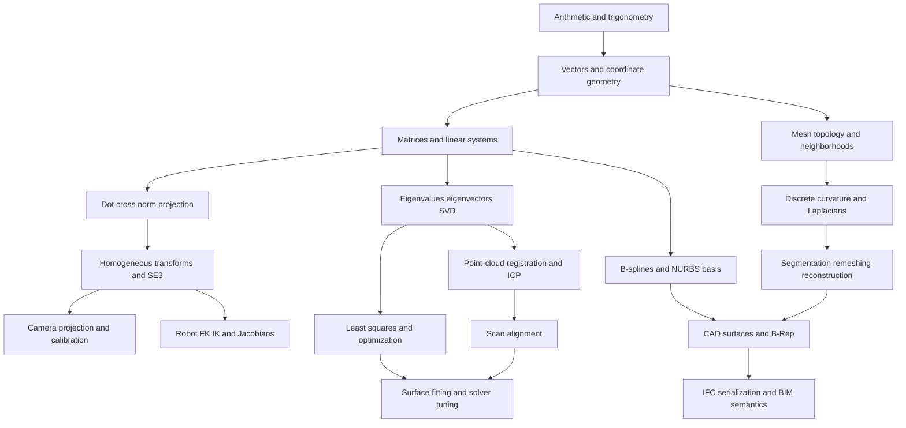
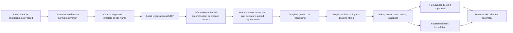

# Geometry Vision and Robotics Knowledge Layer for C++ Reverse Engineering

## Executive summary

The strongest way to unify geometry processing, computer vision, and robot kinematics is to treat them as three views of the same mathematical stack: **linear algebra for coordinates and motion**, **optimization for fitting and alignment**, and **discrete or parametric geometry for shape representation**. In practice, that means you should learn vectors, matrices, rigid transforms, and Jacobians first; then least-squares solvers and robust estimation; then splines, meshes, and B-Reps; and only after that build production software around OpenCV, PCL, OpenCASCADE, and IfcOpenShell. This ordering also matches the most robust scan-to-CAD and scan-to-BIM pipeline for messy stone: **implicit reconstruction or defect-tolerant cleanup → feature-aware remeshing or segmentation → parametric fitting → B-Rep construction → IFC serialization**, rather than trying to fit NURBS directly to raw, incomplete point clouds. citeturn32view0turn6view0turn18view3turn20view0turn11view0turn15view4 fileciteturn0file5

For your background as a computational designer moving from high-school math and basic OpenCV/Python toward production C++, the key idea is this: **the same transform math that projects a 3D point into a camera image also moves a robot end-effector and locates a CAD face in world space**. The same least-squares logic that calibrates a camera also solves ICP alignment and numerical inverse kinematics. The same graph neighborhood ideas that define a mesh Laplacian also power point-cloud processing and graph neural networks. citeturn32view0turn6view0turn29search1turn43academia2

This document is written to be both a **human learning guide** and an **AI-agent ingest layer**. It therefore includes a compact ontology, a staged learning path, first-principles equations, C++ reference patterns, a reverse-engineering workflow for irregular stone, implementation trade-offs, and a prioritized source stack. The biggest practical recommendation is simple: **prototype in Python if needed, but design your math and data structures as if they will live in C++ from day one**. COMPAS is useful as a computational-design reference environment, but it is Python-first; your production core should center on Eigen plus domain libraries. citeturn30view1turn6view0turn11view0turn15view4

## Agent-ingest knowledge layer

### Core ontology

For an AI agent or software architecture, the minimum useful ontology is:

| Entity | Meaning | Canonical math object | Typical C++ library |
|---|---|---|---|
| Point cloud | Unordered samples of a surface | Set \( \{p_i \in \mathbb{R}^3\} \) | PCL, custom Eigen |
| Mesh | Explicit discrete surface | Graph plus faces \(V,E,F\) | OpenMesh, libigl, Geogram |
| Pose | Position and orientation | \(T \in SE(3)\) | Eigen, Sophus, custom |
| Camera | Projective sensor | \(p \sim K[R\mid t]P\) | OpenCV |
| Robot arm | Serial chain of joints | DH or PoE model | Eigen, custom, Modern Robotics-style code |
| Spline curve or surface | Parametric CAD geometry | B-spline or NURBS basis | OpenCASCADE |
| B-Rep | Topological solid model | faces + edges + vertices + tolerances | OpenCASCADE |
| BIM element | Semantic building object | IFC entity graph | IfcOpenShell |

These entities are connected by a small set of operations: **transform**, **project**, **differentiate**, **optimize**, **resample**, **fit**, **validate**, and **serialize**. OpenCV formalizes projection with the pinhole model \(s\,p = A[R\mid t]P_w\); Modern Robotics organizes robot motion around \(SE(3)\), twists, exponentials, and Jacobians; OpenCASCADE turns ordered point data into B-spline surfaces and B-Reps; IfcOpenShell turns IFC representations into triangles or OpenCASCADE B-Reps and recommends iterator-based bulk geometry processing for efficiency. citeturn32view0turn5view0turn6view0turn11view0turn15view3turn15view4

### Operational rules

Your agent should follow a few hard rules.

If the input is **messy or incomplete scan data**, do **not** jump straight to NURBS. Use an intermediate defect-tolerant representation first, such as a signed distance field or a cleaned remesh, then segment, then fit CAD patches. This is the strongest rule in the scan-to-BIM material you supplied and is also consistent with Signed Heat, Geogram, and OpenCASCADE’s expectations for ordered fitting data. citeturn18view3turn20view0turn11view0 fileciteturn0file5

If the task is about **motion, registration, or camera pose**, the primary state object is always a rigid transform in \(SE(3)\). Keep units, frame names, and handedness explicit. Most real bugs in vision, robotics, and CAD pipelines are not “math bugs” but **frame-consistency bugs**. OpenCV’s calib3d module, Modern Robotics, and IFC geometry pipelines all depend on exact frame conventions. citeturn32view0turn6view0turn15view4

If the output is a **CAD solid or IFC element**, validate topology and tolerances before export. OpenCASCADE provides sewing, validity analysis, and controlled tessellation parameters for this exact reason. citeturn12view0turn12view2turn12view3

### Dependency graph



That graph is not arbitrary. It mirrors the prerequisite structure emphasized by Modern Robotics for spatial motion and kinematics, by OpenCV for camera projection and calibration, by Kevin Crane’s DDG-centered teaching stack for geometry processing, and by OpenCASCADE plus IfcOpenShell for downstream CAD and BIM geometry handling. citeturn5view0turn32view0turn2view0turn11view0turn15view3

## Learning path and dependency milestones

### Stage design

The learning path below is the shortest path that still preserves mathematical integrity.

| Stage | What you should be able to do | Math focus | Software milestone |
|---|---|---|---|
| High-school bridge | Read vectors, slopes, trig, similar triangles, and basic functions confidently | Trig, coordinate geometry, basic derivatives | Write 2D and 3D vector utilities in C++ |
| Computational designer bridge | Use 4×4 transforms, camera projection, basic spline ideas, and mesh neighborhoods | Matrices, homogeneous coordinates, least squares, basis functions | Rebuild Grasshopper-style transform workflows in Eigen/OpenCV |
| Geometry and vision core | Estimate pose, calibrate cameras, register point clouds, compute normals and local frames | SVD, optimization, projective geometry | Implement ICP, PnP, normal estimation, voxel filtering |
| Robotics core | Build FK, Jacobians, numerical IK, singularity checks | \(SE(3)\), twists, adjoints, pseudoinverses | Implement PoE FK and damped-least-squares IK |
| CAD kernel core | Fit splines, build faces and solids, sew and validate topology | B-splines, continuity, tolerances, topology | Create OCCT B-spline surfaces and B-Reps |
| Scan-to-BIM core | Convert cleaned geometry to IFC with semantics and fallbacks | Data modeling, serialization, tolerance management | Export IFC BRep or tessellated fallback |

This sequence is consistent with the prerequisite guidance on the Modern Robotics site, which expects first-year engineering math plus programming, the OpenCV calibration model, and the DDG-first geometry-processing orientation visible in Crane’s CMU teaching materials. citeturn6view0turn32view0turn2view0

### Milestones that matter

The real milestones are not “chapters completed” but capabilities.

Your first major milestone is: **given a point in world space, project it into a camera and also move it through a robot arm chain**. If you can do that, you understand the shared backbone of vision and robotics. OpenCV expresses the camera side as \(s\,p = K[R\mid t]P_w\), while robot kinematics expresses the arm side as chained rigid transforms or exponentials in \(SE(3)\). citeturn32view0turn6view0

Your second milestone is: **given two shapes, align them by minimizing an error**. That is the bridge to ICP, camera calibration, bundle adjustment, and inverse kinematics. All become variants of nonlinear least squares with different residuals and Jacobians. citeturn29search1turn40search2turn41search0

Your third milestone is: **given noisy samples, produce a stable geometric model**. That takes you from point clouds to remeshing, spline fitting, B-Reps, and IFC. This is where the scan-to-BIM pipeline becomes a software system rather than a collection of disconnected scripts. citeturn18view3turn20view0turn11view0turn15view4

## Mathematical bridges from first principles

### Shared transform language

The unifying object across all three domains is the rigid transform

\[
T =
\begin{bmatrix}
R & t \\
0 & 1
\end{bmatrix},
\qquad R \in SO(3),\; t \in \mathbb{R}^3.
\]

For a world point \(P_w = [X_w,Y_w,Z_w,1]^T\), OpenCV writes camera projection as

\[
s\,p = K [R \mid t] P_w,
\]

with

\[
K=
\begin{bmatrix}
f_x & 0 & c_x\\
0 & f_y & c_y\\
0 & 0 & 1
\end{bmatrix}.
\]

This is the exact bridge between camera geometry and robotics: first transform from world to camera coordinates, then project. The same homogeneous-transform idea is used in robot kinematics and in CAD placement. OpenCV’s documentation explicitly derives this camera model and emphasizes homogeneous coordinates because they make affine and projective transformations linear. citeturn32view0

### Robot forward kinematics, DH, PoE, and Jacobians

The classical DH formulation assigns four parameters to each joint-link pair:

\[
a_i,\;\alpha_i,\;d_i,\;\theta_i.
\]

A standard homogeneous transform is

\[
A_i =
\operatorname{Trans}_z(d_i)\,
\operatorname{Rot}_z(\theta_i)\,
\operatorname{Trans}_x(a_i)\,
\operatorname{Rot}_x(\alpha_i).
\]

Then forward kinematics is just

\[
T(\theta)=A_1A_2\cdots A_n.
\]

DH is still useful for industrial-style arms and for reading older literature, but the Product of Exponentials formulation is usually cleaner for software because it separates fixed geometry from joint motion and handles revolute and prismatic joints uniformly. Modern Robotics presents forward kinematics in chapters on rigid-body motion, PoE, Jacobians, and numerical IK, and explicitly teaches rotation matrices, homogeneous transforms, twists, and exponential coordinates as the spatial foundation before manipulator-specific material. citeturn5view0turn6view0

In PoE form,

\[
T(\theta)=e^{[\mathcal{S}_1]\theta_1}\,
e^{[\mathcal{S}_2]\theta_2}\cdots
e^{[\mathcal{S}_n]\theta_n}\,M,
\]

where \(M\) is the home configuration and each \(\mathcal{S}_i\) is a screw axis in the space frame. This is the formulation I recommend for production C++ because it maps naturally to Eigen matrices, avoids DH bookkeeping edge-cases, and makes Jacobians easier to derive in a consistent way. citeturn6view0

The space Jacobian is the linearization of end-effector twist with respect to joint velocities:

\[
V_s = J_s(\theta)\,\dot{\theta}.
\]

In PoE form, the \(i\)-th column is the \(i\)-th screw axis pushed forward by the preceding exponentials through the adjoint operator:

\[
J_s(\theta)=
\begin{bmatrix}
\mathcal{S}_1 &
\operatorname{Ad}_{e^{[\mathcal{S}_1]\theta_1}}\mathcal{S}_2 &
\cdots &
\operatorname{Ad}_{e^{[\mathcal{S}_1]\theta_1}\cdots e^{[\mathcal{S}_{n-1}]\theta_{n-1}}}\mathcal{S}_n
\end{bmatrix}.
\]

This Jacobian tells you velocity mapping, singularities, manipulability, and the local linear model used by numerical IK. Those topics are core parts of the Modern Robotics kinematics sequence. citeturn5view0turn6view0

A robust numerical IK update is damped least squares:

\[
\Delta\theta
=
J^T(JJ^T+\lambda^2 I)^{-1} e,
\]

where \(e\) is the pose error in task space. This is the robotics version of Levenberg–Marquardt regularization: near singularities or poor conditioning, damping keeps the update bounded. The LM method is explicitly a damped nonlinear least-squares method that interpolates between Gauss–Newton and gradient descent. citeturn41search0turn40search2

### ICP, rigid alignment, and optimization

Point-to-point ICP solves

\[
\min_{R,t} \sum_i \|R p_i+t-q_{c(i)}\|^2,
\]

where \(c(i)\) maps each source point to a target correspondence. The alternating logic is simple:

1. find correspondences;
2. solve the best rigid transform;
3. update the source;
4. repeat.

The rigid solve for fixed correspondences comes from the centered covariance matrix. Let

\[
\bar{p}=\frac{1}{N}\sum_i p_i,\qquad
\bar{q}=\frac{1}{N}\sum_i q_i,
\]

\[
\tilde{p}_i=p_i-\bar{p},\qquad
\tilde{q}_i=q_i-\bar{q},
\]

\[
H=\sum_i \tilde{p}_i \tilde{q}_i^T.
\]

If \(H=U\Sigma V^T\), then the optimal rotation is

\[
R = V
\begin{bmatrix}
1&0&0\\
0&1&0\\
0&0&\det(VU^T)
\end{bmatrix}
U^T,
\qquad
t=\bar{q}-R\bar{p}.
\]

This SVD-based rigid alignment is the standard closed-form core used inside many ICP variants. The point-set registration literature summarizes the iterative structure and its dependence on an initially reasonable pose, while Go-ICP highlights the local-minimum problem of standard ICP. The Kabsch-Umeyama literature gives the SVD justification for the rigid solve. citeturn29search1turn28academia0turn35academia2

Point-to-plane ICP replaces Euclidean point residuals with surface-normal residuals:

\[
\min_{R,t} \sum_i \left(n_i^T(Rp_i+t-q_i)\right)^2.
\]

This usually converges faster when target normals are reliable, because it linearizes displacement along the surface tangent directions more intelligently. In production, do coarse alignment first, then point-to-plane ICP second. That recommendation is an inference from the known initialization sensitivity of ICP and from the prevalence of normal-based local refinements in practice. citeturn28academia0turn29search1

For broader solver intuition, many geometry and robotics problems reduce to nonlinear least squares

\[
\min_x \sum_i r_i(x)^2.
\]

Gauss–Newton updates are

\[
x_{k+1}=x_k-(J^TJ)^{-1}J^Tr,
\]

and Levenberg–Marquardt replaces \(J^TJ\) with a damped version, typically \(J^TJ+\lambda I\) or \(J^TJ+\lambda \operatorname{diag}(J^TJ)\). That math underlies camera calibration, bundle adjustment, IK, curve fitting, and registration. citeturn40search2turn41search0

### B-splines, NURBS, fitting, and mesh operators

A NURBS curve is

\[
C(u)=
\frac{\sum_{i=0}^{n} w_i P_i N_{i,p}(u)}
{\sum_{i=0}^{n} w_i N_{i,p}(u)},
\]

where \(P_i\) are control points, \(w_i\) are weights, and \(N_{i,p}\) are B-spline basis functions of degree \(p\). Piegl’s survey emphasizes that NURBS are rational generalizations of B-splines and Bezier forms, are invariant under affine and projective transforms, and became the unifying CAD representation because they can exactly represent conics while also supporting local refinement operations like knot insertion and degree elevation. citeturn36view1turn23view3turn23view1

A tensor-product NURBS surface is the 2D analogue:

\[
S(u,v)=
\frac{\sum_i \sum_j w_{ij} P_{ij} N_{i,p}(u) M_{j,q}(v)}
{\sum_i \sum_j w_{ij} N_{i,p}(u) M_{j,q}(v)}.
\]

OpenCASCADE’s `GeomAPI_PointsToBSplineSurface` will approximate or interpolate an **ordered** array of points, with degree bounds, continuity targets such as \(C^2\), and a geometric tolerance. The reference manual also notes that centripetal parameterization can produce better results when sample spacing is irregular. That matters a lot for scan fitting. citeturn11view0

For mesh processing, the discrete Laplace-Beltrami operator is the engine for smoothing, fairing, parameterization, and some segmentation workflows. In cotangent form, a common discretization is

\[
(\Delta f)_i
=
\frac{1}{2A_i}
\sum_{j\in N(i)}
(\cot \alpha_{ij} + \cot \beta_{ij})(f_j-f_i).
\]

Bobenko and Springborn discuss the cotan-style discrete Laplace-Beltrami operator on simplicial surfaces, while CMU’s DDG-oriented teaching ecosystem frames this style of thinking as the modern geometry-processing foundation. citeturn44academia1turn2view0

### Where AI models fit

The right way to learn “AI models” for your workflow is **after** you understand the deterministic backbone above.

A supervised model is still just optimization:

\[
\min_\theta \frac{1}{N}\sum_{i=1}^N \ell(f_\theta(x_i), y_i)+\lambda R(\theta).
\]

What changes is the parameterization of \(f_\theta\). For **Transformers**,

\[
\mathrm{Attention}(Q,K,V)=
\mathrm{softmax}\!\left(\frac{QK^T}{\sqrt{d_k}}\right)V,
\]

for **message-passing neural networks** on point or mesh graphs,

\[
h_u = \phi\!\left(x_u,\; \bigoplus_{v\in N_u}\psi(x_u,x_v,e_{uv})\right),
\]

and for **neural implicit geometry**, a network predicts a signed distance value \(f_\theta(x)\) rather than fitting an explicit surface patch. Those three model families map well to your domains: transformers for correspondence and multimodal planning, graph models for mesh and point neighborhoods, and implicit models for shape completion or SDFs. PointNet is the canonical entry point for point clouds, DeepSDF for learned implicit shape representation, and MPNNs for graph-structured learning. citeturn42academia0turn43academia2turn42academia1turn42academia2

The teaching recommendation is: **do not start with large models**. First learn the residual, Jacobian, loss, and update rule in classical geometry problems. Once those are intuitive, AI models become “different function classes trained by the same optimization logic,” not black boxes. citeturn40search2turn41search0turn42academia0turn42academia1turn42academia2

## C++ implementation patterns and reference snippets

### Library stack and trade-offs

The most coherent production stack for your goals looks like this.

| Layer | Best role | Why |
|---|---|---|
| Eigen | Core linear algebra | Small, direct, ideal for transforms, Jacobians, SVD-style code |
| OpenCV | Camera calibration, PnP, image geometry | Official calib3d model is standard and mature |
| PCL or custom cloud layer | Point-cloud filtering, normals, kd-trees, ICP scaffolding | Practical C++ point-cloud ecosystem |
| Geogram | Feature-aware remeshing and CVT-style discretization | Strong anisotropic remeshing workflow |
| signed-heat-3d | Robust signed-distance reconstruction from broken geometry | Defect-tolerant implicit geometry |
| OpenCASCADE | NURBS fitting, B-Rep, validation, meshing | Industrial CAD kernel |
| IfcOpenShell | IFC parsing and geometry serialization | Standard IFC bridge |
| COMPAS | Reference ideas and prototyping, not final C++ core | Python-first, good for design thinking and AECO workflows |

The strongest evidence-backed choices here are OpenCV for projection and calibration, Geogram for anisotropic remeshing, Signed Heat for robust SDFs, OpenCASCADE for CAD surfaces and topology, IfcOpenShell for IFC processing, and COMPAS as a Python framework for computational design research rather than a C++ production kernel. citeturn32view0turn20view0turn17view0turn18view3turn11view0turn15view3turn30view1

### Minimal PoE FK and damped-IK reference

```cpp
// fk_ik_poe.hpp
#pragma once
#include <Eigen/Dense>
#include <vector>
#include <stdexcept>
#include <cmath>

namespace kinematics {

using Vec6 = Eigen::Matrix<double, 6, 1>;
using Mat4 = Eigen::Matrix4d;
using Mat6 = Eigen::Matrix<double, 6, 6>;

inline Eigen::Matrix3d hat3(const Eigen::Vector3d& w) {
    Eigen::Matrix3d W;
    W <<     0.0, -w.z(),  w.y(),
          w.z(),     0.0, -w.x(),
         -w.y(),  w.x(),    0.0;
    return W;
}

inline Mat4 hat6(const Vec6& S) {
    Mat4 X = Mat4::Zero();
    X.block<3,3>(0,0) = hat3(S.head<3>());
    X.block<3,1>(0,3) = S.tail<3>();
    return X;
}

inline Eigen::Matrix3d expSO3(const Eigen::Vector3d& w, double theta) {
    const double n = w.norm();
    if (n < 1e-12) return Eigen::Matrix3d::Identity();
    Eigen::Vector3d wn = w / n;
    Eigen::Matrix3d W = hat3(wn);
    return Eigen::Matrix3d::Identity()
         + std::sin(n * theta) * W
         + (1.0 - std::cos(n * theta)) * (W * W);
}

inline Mat4 expSE3(const Vec6& S, double theta) {
    const Eigen::Vector3d w = S.head<3>();
    const Eigen::Vector3d v = S.tail<3>();
    Mat4 T = Mat4::Identity();

    if (w.norm() < 1e-12) {
        T.block<3,1>(0,3) = v * theta;  // prismatic
        return T;
    }

    Eigen::Matrix3d R = expSO3(w, theta);
    Eigen::Matrix3d W = hat3(w.normalized());
    const double th = w.norm() * theta;

    Eigen::Matrix3d G = Eigen::Matrix3d::Identity() * th
                      + (1.0 - std::cos(th)) * W
                      + (th - std::sin(th)) * (W * W);

    T.block<3,3>(0,0) = R;
    T.block<3,1>(0,3) = G * (v / w.norm());
    return T;
}

inline Mat6 adjoint(const Mat4& T) {
    Mat6 Ad = Mat6::Zero();
    Eigen::Matrix3d R = T.block<3,3>(0,0);
    Eigen::Vector3d p = T.block<3,1>(0,3);
    Ad.block<3,3>(0,0) = R;
    Ad.block<3,3>(3,3) = R;
    Ad.block<3,3>(3,0) = hat3(p) * R;
    return Ad;
}

inline Mat4 fkSpace(const std::vector<Vec6>& Slist,
                    const std::vector<double>& theta,
                    const Mat4& M) {
    if (Slist.size() != theta.size()) {
        throw std::runtime_error("Slist/theta size mismatch");
    }
    Mat4 T = Mat4::Identity();
    for (size_t i = 0; i < Slist.size(); ++i) {
        T = T * expSE3(Slist[i], theta[i]);
    }
    return T * M;
}

inline Eigen::MatrixXd spaceJacobian(const std::vector<Vec6>& Slist,
                                     const std::vector<double>& theta) {
    const int n = static_cast<int>(Slist.size());
    Eigen::MatrixXd J(6, n);
    Mat4 T = Mat4::Identity();
    for (int i = 0; i < n; ++i) {
        if (i == 0) {
            J.col(i) = Slist[i];
        } else {
            J.col(i) = adjoint(T) * Slist[i];
        }
        T = T * expSE3(Slist[i], theta[i]);
    }
    return J;
}

// Position-only damped least squares IK step
inline std::vector<double> ikStepPositionDLS(
    const std::vector<Vec6>& Slist,
    const std::vector<double>& theta,
    const Mat4& M,
    const Eigen::Vector3d& target_pos,
    double lambda)
{
    Mat4 T = fkSpace(Slist, theta, M);
    Eigen::Vector3d p = T.block<3,1>(0,3);
    Eigen::Vector3d e = target_pos - p;

    Eigen::MatrixXd J = spaceJacobian(Slist, theta).topRows(3);
    Eigen::Matrix3d A = J * J.transpose() + lambda * lambda * Eigen::Matrix3d::Identity();
    Eigen::VectorXd dtheta = J.transpose() * A.ldlt().solve(e);

    std::vector<double> out = theta;
    for (size_t i = 0; i < out.size(); ++i) out[i] += dtheta(static_cast<int>(i));
    return out;
}

} // namespace kinematics
```

This snippet maps directly onto the Modern Robotics formulation of twists, exponentials, homogeneous transforms, PoE kinematics, and Jacobian-based numerical IK. citeturn5view0turn6view0

### Minimal rigid alignment and naive ICP reference

```cpp
// icp_naive.hpp
#pragma once
#include <Eigen/Dense>
#include <vector>
#include <limits>
#include <stdexcept>

namespace icp {

using Point = Eigen::Vector3d;
using Mat4 = Eigen::Matrix4d;

inline Mat4 bestRigidTransform(const std::vector<Point>& src,
                               const std::vector<Point>& dst) {
    if (src.size() != dst.size() || src.size() < 3) {
        throw std::runtime_error("Need paired point sets of equal size >= 3");
    }

    Point mu_s = Point::Zero(), mu_d = Point::Zero();
    for (size_t i = 0; i < src.size(); ++i) { mu_s += src[i]; mu_d += dst[i]; }
    mu_s /= static_cast<double>(src.size());
    mu_d /= static_cast<double>(dst.size());

    Eigen::Matrix3d H = Eigen::Matrix3d::Zero();
    for (size_t i = 0; i < src.size(); ++i) {
        H += (src[i] - mu_s) * (dst[i] - mu_d).transpose();
    }

    Eigen::JacobiSVD<Eigen::Matrix3d> svd(H, Eigen::ComputeFullU | Eigen::ComputeFullV);
    Eigen::Matrix3d U = svd.matrixU();
    Eigen::Matrix3d V = svd.matrixV();

    Eigen::Matrix3d R = V * Eigen::DiagonalMatrix<double,3>(1.0, 1.0, (V * U.transpose()).determinant()) * U.transpose();
    Point t = mu_d - R * mu_s;

    Mat4 T = Mat4::Identity();
    T.block<3,3>(0,0) = R;
    T.block<3,1>(0,3) = t;
    return T;
}

inline std::vector<Point> transformPoints(const std::vector<Point>& pts, const Mat4& T) {
    std::vector<Point> out;
    out.reserve(pts.size());
    for (const auto& p : pts) {
        out.push_back(T.block<3,3>(0,0) * p + T.block<3,1>(0,3));
    }
    return out;
}

inline Mat4 iterativeClosestPointNaive(const std::vector<Point>& source,
                                       const std::vector<Point>& target,
                                       int max_iters,
                                       double tol)
{
    if (source.empty() || target.empty()) throw std::runtime_error("Empty point set");
    Mat4 T = Mat4::Identity();
    std::vector<Point> cur = source;

    double prev_error = std::numeric_limits<double>::infinity();

    for (int iter = 0; iter < max_iters; ++iter) {
        std::vector<Point> paired_src, paired_dst;
        paired_src.reserve(cur.size());
        paired_dst.reserve(cur.size());

        double error = 0.0;
        for (const auto& p : cur) {
            double best_d2 = std::numeric_limits<double>::infinity();
            Point best_q = target.front();
            for (const auto& q : target) {
                double d2 = (p - q).squaredNorm();
                if (d2 < best_d2) { best_d2 = d2; best_q = q; }
            }
            paired_src.push_back(p);
            paired_dst.push_back(best_q);
            error += best_d2;
        }

        Mat4 dT = bestRigidTransform(paired_src, paired_dst);
        T = dT * T;
        cur = transformPoints(cur, dT);

        error /= static_cast<double>(cur.size());
        if (std::abs(prev_error - error) < tol) break;
        prev_error = error;
    }
    return T;
}

} // namespace icp
```

This example is intentionally small and compilable. For production, replace the \(O(NM)\) nearest-neighbor loop with a kd-tree, add outlier rejection, and switch to point-to-plane residuals if normals are trustworthy. That recommendation follows directly from the standard ICP formulation and its initialization sensitivity. citeturn29search1turn28academia0turn35academia2

### OpenCASCADE spline fitting and B-Rep validation reference

```cpp
#include <GeomAPI_PointsToBSplineSurface.hxx>
#include <Geom_BSplineSurface.hxx>
#include <TColgp_Array2OfPnt.hxx>
#include <BRepBuilderAPI_MakeFace.hxx>
#include <BRepBuilderAPI_Sewing.hxx>
#include <BRepPrimAPI_MakePrism.hxx>
#include <BRepCheck_Analyzer.hxx>
#include <BRepMesh_IncrementalMesh.hxx>
#include <gp_Pnt.hxx>
#include <gp_Vec.hxx>

TopoDS_Shape buildStoneSolidFromGrid(const TColgp_Array2OfPnt& grid,
                                     double fit_tol,
                                     double thickness)
{
    GeomAPI_PointsToBSplineSurface fitter(
        grid,
        3,                      // DegMin
        5,                      // DegMax: conservative in practice
        GeomAbs_C2,
        fit_tol
    );

    if (!fitter.IsDone()) {
        throw std::runtime_error("BSpline surface fitting failed");
    }

    Handle(Geom_BSplineSurface) surf = fitter.Surface();
    TopoDS_Face topFace = BRepBuilderAPI_MakeFace(surf, fit_tol);

    TopoDS_Shape solid = BRepPrimAPI_MakePrism(topFace, gp_Vec(0, 0, -thickness));

    BRepBuilderAPI_Sewing sewing(1.0e-5, true, true, true, false);
    sewing.Add(solid);
    sewing.Perform();
    TopoDS_Shape sewed = sewing.SewedShape();

    BRepCheck_Analyzer analyzer(sewed);
    if (!analyzer.IsValid()) {
        throw std::runtime_error("Invalid B-Rep after sewing");
    }

    // Optional tessellation fallback or viewport preview
    BRepMesh_IncrementalMesh mesher(sewed, 1.0e-3, false, 0.3, true);

    return sewed;
}
```

The key facts here come straight from the OCCT manuals: `GeomAPI_PointsToBSplineSurface` approximates or interpolates an ordered point array with degree and continuity controls; `BRepBuilderAPI_Sewing` merges contiguous topology with explicit tolerance control and optional non-manifold handling; `BRepCheck_Analyzer` validates topology and parameterization; and `BRepMesh_IncrementalMesh` exposes linear and angular deflection controls, including relative and parallel modes. citeturn11view0turn12view0turn12view1turn12view2turn12view3

### Point-cloud resampling to an ordered grid

For stone mapped onto a regular template, the crucial move is to convert an unorganized cloud into an ordered UV grid that OpenCASCADE can fit. The simplest durable strategy is **template-guided resampling**:

1. define a regular grid on the template surface or template plane;
2. shoot each grid sample along the template normal or use local nearest-neighbor aggregation;
3. estimate a robust local point, often by weighted median or PCA plane projection;
4. mark cells with insufficient support as holes;
5. inpaint small holes and split large holes into separate fitting regions.

That logic is an inference from the direct requirements of `GeomAPI_PointsToBSplineSurface`, from the staged scan-to-BIM workflow in your pasted material, and from the fact that messy scan data are rarely already ordered in \((u,v)\). citeturn11view0 fileciteturn0file5

## Reverse-engineering workflow for irregular stone to CAD to IFC

### End-to-end data flow



This is the architecture I recommend for heritage or Frahan-style stone workflows. It matches the strongest conclusion in your pasted scan-to-BIM material: a **staged hybrid pipeline** is more robust than a direct point-cloud-to-NURBS path, especially for irregular, incomplete, variably sampled stone. citeturn18view3turn20view0turn11view0turn15view4 fileciteturn0file5

### Why the staged pipeline wins

Raw scan data are broken in four common ways: holes, overhangs, variable density, and ambiguous boundaries. Signed Heat explicitly targets “broken” geometry and constructs generalized signed distance by diffusing normals, normalizing the result, and integrating a field whose gradient matches those directions. The project page emphasizes robustness to holes, self-intersections, and noise, and the repository notes the practical need for good meshing and the reuse of operators and factorizations for performance. citeturn18view3turn17view0

After implicit cleanup, Geogram’s anisotropic remeshing is a strong next step because it adapts triangle distribution to curvature. The Geogram remeshing notes describe normal lifting to 6D, CVT-style optimization, and the practical preprocessing sequence of computing normals, optionally smoothing normals, setting anisotropy, and remeshing. That makes it much better suited than naive isotropic meshing when you plan to fit top-down templates to bottom-up irregular stone. citeturn20view0

Only after that should you fit NURBS or analytical patches in OpenCASCADE. OCCT expects ordered point arrays and gives you control over degree, continuity, parameterization, and tolerance. If a region contains overhangs or folds that violate a single-valued chart assumption, segment it into multiple patches rather than forcing one spline to do impossible work. That is both a mathematical and an engineering constraint. citeturn11view0 fileciteturn0file5

### IFC strategy

IfcOpenShell’s geometry processing documentation shows two important things for your workflow.

First, it can create either triangulated geometry or an OpenCASCADE BRep representation through `create_shape()`, and it supports hybrid geometry kernels with OpenCASCADE fallback. Second, for bulk processing it recommends the geometry iterator because it supports multicore processing, caching, reuse, and efficient extraction of faces, edges, and vertex arrays. citeturn15view4turn15view3turn15view1

The practical IFC rule is:

- use an **advanced BRep** when your downstream stack handles it reliably and exact curved geometry matters;
- use a **tessellated or faceted fallback** when interoperability is more important than exactness.

That recommendation is an inference from IfcOpenShell’s support for both BRep-style processing and triangulated outputs, together with OpenCASCADE’s explicit tessellation controls. citeturn15view4turn15view3turn12view2

### Performance and failure modes

The main failure modes are predictable.

If ICP diverges, the usual cause is poor initialization or too-large correspondence distance. Standard ICP is local and does not guarantee global optimality; Go-ICP exists precisely because classical ICP can get trapped in bad local minima. citeturn28academia0turn29search1

If spline fitting oscillates or “ripples,” the usual cause is bad sample ordering, large holes, or forcing one patch across incompatible geometric behavior. OpenCASCADE’s fitting interface gives you degree and parameterization choices, and its documentation explicitly notes that centripetal parameterization can help with irregular point spacing. citeturn11view0

If the B-Rep export fails, the usual cause is topological invalidity or tolerance mismatch. Use sewing, then validity analysis, then tessellation fallback. citeturn12view0turn12view3turn12view2

If the IFC pipeline becomes slow, switch to iterator-based geometry processing and cache repeated geometry work, exactly as the IfcOpenShell docs recommend. citeturn15view3

## Knowledge gaps, exercises, and prioritized references

### Most likely knowledge gaps

For your stated starting point, the biggest gaps are probably these.

The first is **matrix fluency**: not just multiplying matrices, but understanding what the rows and columns mean geometrically. Without that, camera projection, robot FK, and OCCT transforms all remain opaque. Modern Robotics and OpenCV both assume this fluency early. citeturn6view0turn32view0

The second is **linearization and Jacobians**. Many people can read a closed-form equation for FK or projection but still struggle with why IK, calibration, and ICP are solved iteratively. That gap is solved by learning residuals, Jacobians, and Gauss–Newton or LM on small problems first. citeturn6view0turn40search2turn41search0

The third is **discrete geometry intuition**. In design practice it is common to think in terms of smooth surfaces, but production software often works on sampled or triangulated approximations first, then derives CAD from them. CMU’s DDG framing and modern geometry-processing papers make this shift explicit. citeturn2view0turn44academia1

### Targeted exercises

Work these in order.

Start with a **2D transform notebook**, but write it in C++. Build translation, rotation, scaling, and homogeneous composition. Then project a few points through a synthetic camera matrix. This closes the gap between design-space intuition and machine representation. citeturn32view0

Build a **planar 2-link arm** with analytic FK and numerical IK. Then upgrade it to a 6-DOF serial chain using PoE. Print the Jacobian at each iteration and inspect what happens near singularities. citeturn5view0turn6view0

Implement **paired-point SVD rigid alignment**, then wrap it inside naive ICP, then replace the correspondence loop with a kd-tree. This gives you reusable code for registration, calibration intuition, and solver debugging. citeturn29search1turn35academia2

Fit a **cubic B-spline curve** from sample points, then a tensor-product surface over a regular grid, then reproduce the same fit via OpenCASCADE. Compare interpolation versus approximation and inspect what changing weights or control points actually does. citeturn36view1turn36view2turn11view0

Finally, run a **mini scan-to-CAD pipeline**: synthetic point cloud → coarse align → ICP → grid resample → BSpline surface → prism solid → validate → tessellate. Once that works, add the IFC layer. citeturn11view0turn12view0turn12view2turn15view3

### Prioritized reference stack

These are the sources I would prioritize, in order, for your exact goals.

The best robotics backbone is **Modern Robotics** and its companion site, because it teaches \(SE(3)\), twists, PoE, Jacobians, numerical IK, and optimization in one coherent flow that is explicitly designed for students and programmers. citeturn6view0turn5view0

For geometry processing mindset, **Keenan Crane’s CMU and DDG teaching ecosystem** is the right conceptual anchor. It emphasizes discrete differential geometry, practical code, and modern geometry thinking rather than only classical CAD formulas. citeturn2view0

For NURBS foundations, start with **Piegl’s survey on NURBS**, then move to implementation in OpenCASCADE. The survey is still excellent for understanding why rational B-splines matter and how they unify curve and surface representations. citeturn23view1turn36view1turn23view3

For the actual CAD kernel behavior, rely on **OpenCASCADE’s reference manual** for fitting, sewing, validity checking, and tessellation. citeturn11view0turn12view0turn12view2turn12view3

For IFC workflows, use **IfcOpenShell’s geometry-processing and API docs**, especially the iterator and OpenCASCADE-BRep paths. citeturn15view3turn15view4turn15view1

For scan cleanup and feature-aware geometry, use **Signed Heat** and **Geogram**. Signed Heat gives a mathematically principled way to survive broken geometry; Geogram gives curvature-aware remeshing and discretization. citeturn18view3turn17view0turn20view0

For computational-design perspective and prototyping references, keep **COMPAS** in view, but treat it as a conceptual and scripting-layer resource rather than your final compiled kernel. citeturn30view1

Your pasted scan-to-BIM synthesis is also valuable because it already points toward the right systems architecture: staged, defect-tolerant, feature-aware, kernel-backed, and IFC-aware. fileciteturn0file5

### Open questions and limitations

A few details remain intentionally open-ended because your prompt left them open: robot topology, point-cloud density, target CAD template format, IFC schema detail, and the exact IfcOpenShell C++ version you will compile against. Those specifics change solver choices, parameter defaults, patch segmentation strategy, and whether you should prefer analytic IK, numerical IK, or a fully optimization-based stack. The core mathematical dependencies and architecture above remain stable, but those final engineering choices should be decided per project. citeturn6view0turn11view0turn15view3