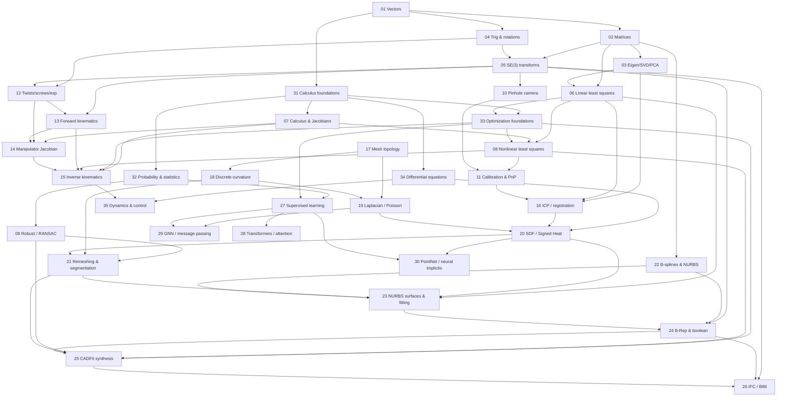

# Math for Scan -> CAD -> IFC + CADFit (+ Robotic Fabrication)

A teaching corpus that takes you from high-school math to the mathematics behind an irregular-stone scan-to-CAD-to-IFC pipeline, a CADFit-style CAD-program-synthesis layer, and robot motion. Each topic file teaches at two levels: **the math** (first principles, LaTeX, worked example) and **the code** (idiomatic C++ first, Eigen / OpenCASCADE / domain libraries), plus pitfalls, exercises, references, and **flashcard seeds** for Anki.

Built from the two deep-research reports in `D:\math` (`deep-research-report.md` and `deep-research-report (1).md`) and aligned to the master dependency graph. 35 topics, 621 flashcard seeds.

## How to use

1. Follow the **recommended learning order** below; each topic states its prerequisites and what it unlocks.
2. Read the math sections, do the worked example by hand, then run the code.
3. Wiki-links like `[[19_laplacian-poisson]]` cross-reference related topics.
4. When ready, import the flashcards (see **Flashcard build plan**) and review in Anki.

## Module map

| Module | Topics |
|---|---|
| **0. Foundations** | 01 vectors, 02 matrices, 31 calculus-foundations, 03 eigen/SVD/PCA, 04 trig+rotations, 05 SE(3) transforms, 32 probability/statistics |
| **1. Optimization & numerics** | 06 linear least squares, 07 calculus & Jacobians, 33 optimization foundations, 08 nonlinear least squares, 09 robust/RANSAC, 34 differential equations |
| **2. Computer vision** | 10 pinhole camera, 11 calibration & PnP |
| **3. Robot kinematics & control** | 12 twists/screws/exp, 13 forward kinematics, 14 manipulator Jacobian, 15 inverse kinematics, 35 dynamics & control |
| **4. Registration** | 16 ICP / Kabsch-Umeyama |
| **5. Geometry processing** | 17 mesh topology, 18 discrete curvature, 19 Laplacian/Poisson, 20 SDF/Signed Heat, 21 remeshing/segmentation |
| **6. CAD modeling** | 22 B-splines/NURBS, 23 NURBS surfaces & fitting, 24 B-Rep/boolean (OCCT), 25 CADFit synthesis, 26 IFC/BIM |
| **7. AI layer** | 27 supervised learning, 28 transformers, 29 GNNs, 30 PointNet/neural implicits |
| **8. Fab Loop** | 36 state estimation & filtering, 37 trajectory planning & collision, 38 toolpath / CAM |

> Geodesic distance (the master graph's "curvature, smoothing, geodesics" node) is taught via the heat method inside [[19_laplacian-poisson]], [[20_sdf-signed-heat]], and [[34_differential-equations]].

## Dependency graph

## Recommended learning order

| # | Topic | What it gives you | Cards |
|---|---|---|---|
| 1 | [01 Vectors](01_vectors.md) | dot/cross/norms, frames | 18 |
| 2 | [02 Matrices](02_matrices.md) | linear maps, solving Ax=b | 20 |
| 3 | [31 Calculus foundations](31_calculus-foundations.md) | derivatives, integrals, grad/div/Laplacian | 16 |
| 4 | [03 Eigen/SVD/PCA](03_eig-svd-pca.md) | SVD, PCA frames, normals | 19 |
| 5 | [04 Trig & rotations](04_trig-rotations.md) | SO(3), axis-angle, quaternions | 20 |
| 6 | [05 SE(3) transforms](05_transforms-se3.md) | homogeneous rigid transforms | 19 |
| 7 | [07 Calculus & Jacobians](07_calculus-jacobians.md) | linearization for solvers | 19 |
| 8 | [06 Linear least squares](06_linear-least-squares.md) | normal equations, QR/SVD | 18 |
| 9 | [32 Probability & statistics](32_probability-statistics.md) | Gaussians, MLE, least-squares bridge | 15 |
| 10 | [33 Optimization foundations](33_optimization-foundations.md) | gradient descent, convexity, KKT | 16 |
| 11 | [08 Nonlinear least squares](08_nonlinear-least-squares.md) | Gauss-Newton, Levenberg-Marquardt | 18 |
| 12 | [09 Robust / RANSAC](09_robust-ransac.md) | outliers, primitive fitting | 19 |
| 13 | [34 Differential equations](34_differential-equations.md) | ODE/PDE, RK4, heat equation | 15 |
| 14 | [10 Pinhole camera](10_camera-pinhole.md) | projection s p = K[R\|t]P | 18 |
| 15 | [11 Calibration & PnP](11_calibration-pnp.md) | pose from correspondences | 19 |
| 16 | [12 Twists/screws/exp](12_twists-screws-exp.md) | se(3) -> SE(3) exponential | 18 |
| 17 | [13 Forward kinematics](13_forward-kinematics.md) | DH and Product of Exponentials | 18 |
| 18 | [14 Manipulator Jacobian](14_manipulator-jacobian.md) | velocity, singularities | 19 |
| 19 | [15 Inverse kinematics](15_inverse-kinematics.md) | damped least squares | 19 |
| 20 | [35 Dynamics & control](35_dynamics-control.md) | equations of motion, PID | 15 |
| 21 | [16 ICP / registration](16_registration-icp.md) | Kabsch-Umeyama, ICP | 20 |
| 22 | [17 Mesh topology](17_mesh-topology.md) | half-edge, manifoldness | 20 |
| 23 | [18 Discrete curvature](18_discrete-curvature.md) | angle defect, normals | 20 |
| 24 | [19 Laplacian / Poisson](19_laplacian-poisson.md) | cotan Laplacian, smoothing | 18 |
| 25 | [20 SDF / Signed Heat](20_sdf-signed-heat.md) | robust signed distance | 19 |
| 26 | [21 Remeshing & segmentation](21_remeshing-segmentation.md) | CVT, curvature-guided segmentation | 18 |
| 27 | [22 B-splines & NURBS](22_bsplines-nurbs-curves.md) | basis functions, curves | 19 |
| 28 | [23 NURBS surfaces & fitting](23_nurbs-surfaces-fitting.md) | surface fit from scans | 19 |
| 29 | [24 B-Rep & boolean (OCCT)](24_brep-boolean-occt.md) | sewing, validation, booleans | 20 |
| 30 | [25 CADFit synthesis](25_cadfit-program-synthesis.md) | recover editable CAD programs | 19 |
| 31 | [26 IFC / BIM](26_ifc-bim.md) | semantic export | 13 |
| 32 | [27 Supervised learning](27_supervised-learning-optimization.md) | loss, gradients, regularization | 19 |
| 33 | [28 Transformers / attention](28_transformers-attention.md) | scaled dot-product attention | 13 |
| 34 | [29 GNN / message passing](29_gnn-message-passing.md) | GCN, message passing | 13 |
| 35 | [30 PointNet / neural implicits](30_pointnet-neural-implicits.md) | sets, learned SDFs | 13 |
| 36 | [36 State estimation & filtering](36_state-estimation-filtering.md) | Kalman/EKF, sensor fusion | 24 |
| 37 | [37 Trajectory planning & collision](37_trajectory-planning-collision.md) | C-space, RRT, collision | 26 |
| 38 | [38 Toolpath / CAM](38_toolpath-process-planning.md) | cusp height, offsets, gouge | 25 |

> Cards were later rebuilt **derivation-first** (front: derive from the diagram; back: step chain to a boxed equation + the diagram) with diversified examples and closing-test loops; the live Anki deck now holds ~1043 cards across the 9 module subdecks.

## Capability milestones

1. **Move a point two ways.** Project a 3-D point into a camera and push it through a robot arm chain. You have understood the shared SE(3) backbone of vision and robotics (topics 05, 10, 13).
2. **Align two shapes.** Register two point sets by minimizing an error. This unlocks ICP, calibration, bundle adjustment, and IK as one idea (topics 08, 11, 15, 16).
3. **Turn noise into a model.** Take a messy scan to a stable geometric model: clean -> remesh -> fit -> B-Rep (topics 20, 21, 23, 24).
4. **Recover a CAD program.** Infer the editable operations that would have produced a shape, not just its boundary (topic 25).

## Flashcard build plan

- **Total seeds:** 621 across 35 files, in two formats:
  - `Q: <question> :: A: <answer>` -> **Basic** note (`Front`/`Back`).
  - `CLOZE: <... {{c1::hidden}} ...>` -> **Cloze** note (`Text`).
- **Deck structure** (Anki MCP caps nesting at 2 levels, so modules are subdecks):
  - `Math4Stone::Foundations`, `::Optimization`, `::Vision`, `::Robotics`, `::Registration`, `::Geometry Processing`, `::CAD`, `::AI Layer`.
- **Tags:** `topic::NN_slug`, `module::<name>`, `difficulty::{intro,core,advanced}`.
- **Import path:** the Anki MCP at `tunnel.ankimcp.ai` (registered as `anki`) or the local port; build with `create_deck` + batch `add_notes`, routing `Q::A` to Basic and `CLOZE` to Cloze.
